# P1

# P2
* P1(15%): 9.20 / 10.00,  Document (45%): 8.5; Presentation (35%): 9.5; Answers (20%): 10
* P2(30%): 7.15 / 10.00,  a) 5,6, b) 8,25, c) 9
* P3(45%): 7.15 / 10.00,  a) 5,6, b) 8,25, c) 9

# P3 ICU Mortality Prediction

Advanced ICU mortality prediction system using machine learning with baseline and SOFA-enhanced models. Achieves **91.7% accuracy** and **0.904 AUC** with the best performing model.

## 📁 Project Structure

```
P3/
├── mortality_prediction_models.py       # Baseline models training script
├── mortality_prediction_models_sofa.py  # SOFA-enhanced models training script
├── analyze_oncology_bug.py              # Oncology analysis utility
├── api/
│   ├── mlapi.py                         # FastAPI server (8 models)
│   ├── index.html                       # Web interface
│   ├── API_USAGE_GUIDE.md              # Comprehensive API documentation
│   └── models/                          # Saved models (auto-generated)
│       ├── xgboost.pkl                  # Baseline models
│       ├── random_forest.pkl
│       ├── logistic_regression.pkl
│       ├── lightgbm.pkl
│       ├── xgboost_sofa.pkl            # SOFA-enhanced models
│       ├── random_forest_sofa.pkl
│       ├── logistic_regression_sofa.pkl
│       └── lightgbm_sofa.pkl
├── documentation/
│   ├── MODEL_IMPROVEMENTS_SUMMARY.md    # Model enhancement details
│   ├── MODELS_COMPARISON_REPORT.md      # Comparative analysis
│   └── scientific_publication.md        # Research manuscript
├── results_images/                      # Visualizations (auto-generated)
│   ├── model_comparison.png             # Baseline comparison
│   ├── model_comparison_sofa.png        # SOFA comparison
│   ├── roc_curves_comparison.png        # Baseline ROC curves
│   ├── roc_curves_comparison_sofa.png   # SOFA ROC curves
│   ├── feature_importance_*.png         # All models (8 variants)
│   └── model_metrics_summary*.csv       # Performance metrics
├── db_processing/
│   └── A3_v2_all_sofa_extra.ipynb      # Data processing notebook
└── resources_p3/
    └── df_icu.csv                       # Training data
```

## 🚀 Usage

### 1. Train Models

**Train Baseline Models:**
```bash
cd P3
../.venv/bin/python mortality_prediction_models.py
```

**Train SOFA-Enhanced Models:**
```bash
../.venv/bin/python mortality_prediction_models_sofa.py
```

This will:
- Train 8 models total (4 baseline + 4 SOFA-enhanced)
- Models: XGBoost, Random Forest, Logistic Regression, LightGBM
- Generate performance visualizations and metrics
- Save all models to `api/models/`
- Output comparison charts and feature importance plots

### 2. Start API
```bash
source ../.venv/bin/activate && uvicorn api.mlapi:app --reload --port 8000
```

> **Note:** Run from `P3/` directory

**Access Points:**
- Web Interface: http://localhost:8000
- API Documentation: http://localhost:8000/docs
- Available Models: 8 (4 baseline + 4 SOFA-enhanced)

### 2.1. Share URL for Presentation (Cloudflare Tunnel - @MIDUDEV)
```bash
brew install cloudflared
# Replace with your local URL
cloudflared tunnel --url http://127.0.0.1:8000/
```

This creates a public URL for demo purposes.


### 3. Make Predictions

**Web Interface:**
- Open http://localhost:8000

**API Endpoints:**

*Baseline Model (12 features):*
```bash
curl -X POST http://localhost:8000/predict/random_forest \
  -H "Content-Type: application/json" \
  -d '{
    "GENDER": "M",
    "AGE": 65,
    "ETHNICITY_GROUP": "WHITE",
    "diabetes_comorbidity": 1,
    "hypertension_comorbidity": 1,
    "ckd_comorbidity": 0,
    "chf_comorbidity": 0,
    "copd_comorbidity": 0,
    "cancer_comorbidity": 0,
    "diagnosis_group": "cardiovascular",
    "resp_procedure": 0
  }'
```

*SOFA-Enhanced Model (30+ features) - RECOMMENDED:*
```bash
curl -X POST http://localhost:8000/predict/random_forest_sofa \
  -H "Content-Type: application/json" \
  -d '{...}'  # See API_USAGE_GUIDE.md for full schema
```

> 📘 For complete API documentation and SOFA model schemas, see [API_USAGE_GUIDE.md](P3/api/API_USAGE_GUIDE.md)

## 📦 Requirements

```bash
pip install pandas numpy matplotlib seaborn scikit-learn xgboost lightgbm fastapi uvicorn
```

**Python Version:** 3.8+

**Key Dependencies:**
- `scikit-learn` - ML algorithms (Random Forest, Logistic Regression)
- `xgboost` - Gradient boosting
- `lightgbm` - Light gradient boosting
- `fastapi` - API framework
- `uvicorn` - ASGI server
- `pandas`, `numpy` - Data processing
- `matplotlib`, `seaborn` - Visualizations

**Python Version:** 3.8+

**Key Dependencies:**
- `scikit-learn` - ML algorithms (Random Forest, Logistic Regression)
- `xgboost` - Gradient boosting
- `lightgbm` - Light gradient boosting
- `fastapi` - API framework
- `uvicorn` - ASGI server
- `pandas`, `numpy` - Data processing
- `matplotlib`, `seaborn` - Visualizations

## 🎯 Model Performance

### Baseline Models (Without SOFA Score)

| Model | AUC | Accuracy | Precision | Recall | Specificity | F1-Score |
|-------|-----|----------|-----------|--------|-------------|----------|
| XGBoost | 0.875 | 80.3% | 0.298 | 0.816 | 0.802 | 0.436 |
| Random Forest | 0.875 | 85.9% | 0.365 | 0.699 | 0.875 | 0.480 |
| LightGBM | 0.859 | 85.2% | 0.350 | 0.680 | 0.870 | 0.462 |
| Logistic Regression | 0.856 | 78.1% | 0.272 | 0.806 | 0.778 | 0.407 |

### Enhanced Models (With SOFA Score)

| Model | AUC | Accuracy | Precision | Recall | Specificity | F1-Score |
|-------|-----|----------|-----------|--------|-------------|----------|
| Random Forest | 0.904 | 91.7% | 0.548 | 0.660 | 0.944 | 0.599 |
| XGBoost | 0.899 | 87.6% | 0.409 | 0.738 | 0.890 | 0.526 |
| Logistic Regression | 0.879 | 80.0% | 0.294 | 0.816 | 0.798 | 0.432 |
| LightGBM | 0.875 | 91.2% | 0.535 | 0.447 | 0.960 | 0.487 |

**Best Model:** Random Forest with SOFA score (AUC: 0.904, Accuracy: 91.7%)

### 📊 Model Comparison Visualizations

#### Baseline Models
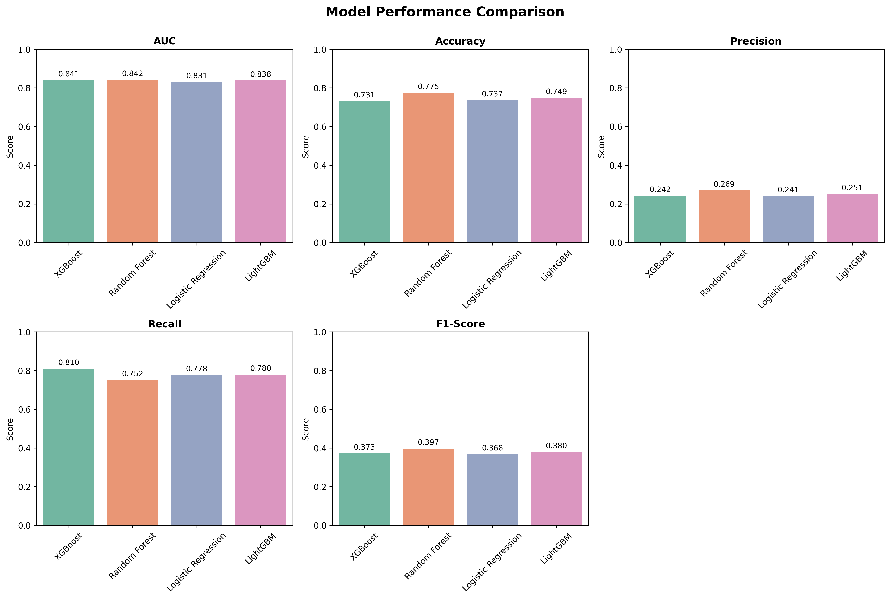
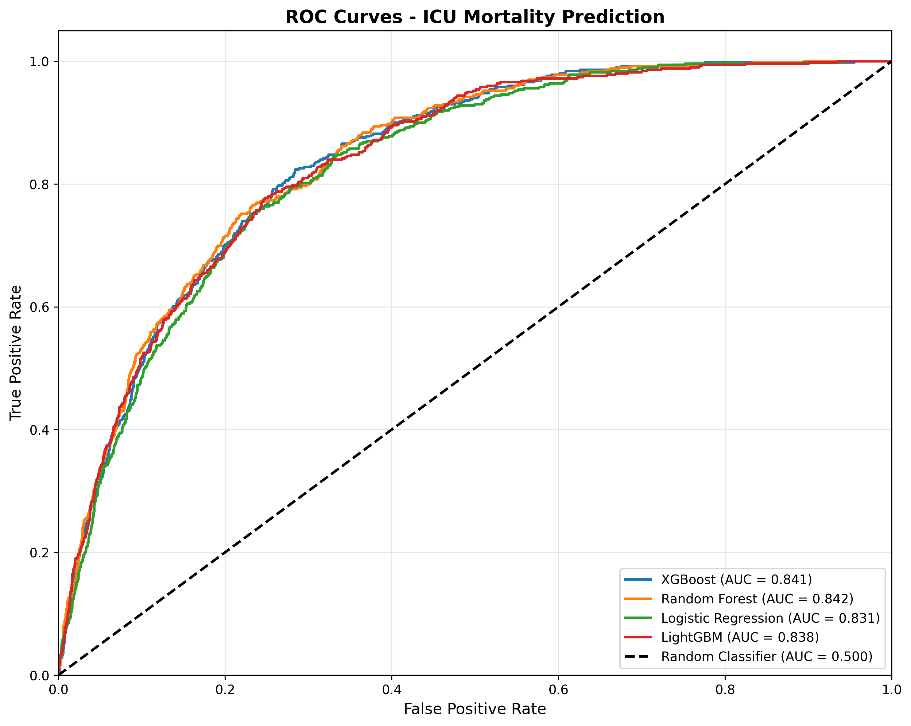

#### Enhanced Models with SOFA Score
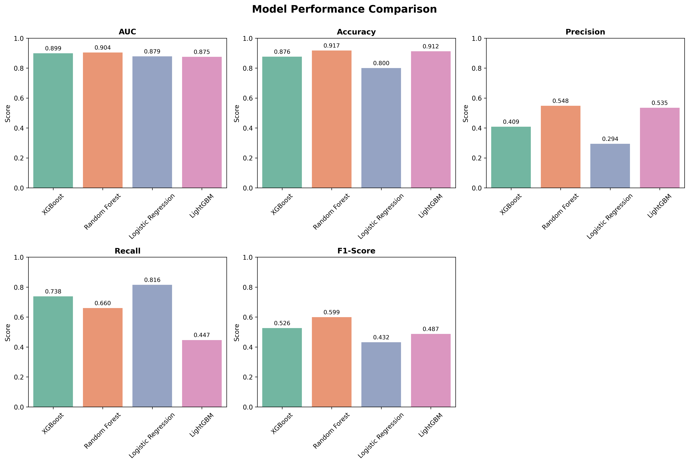
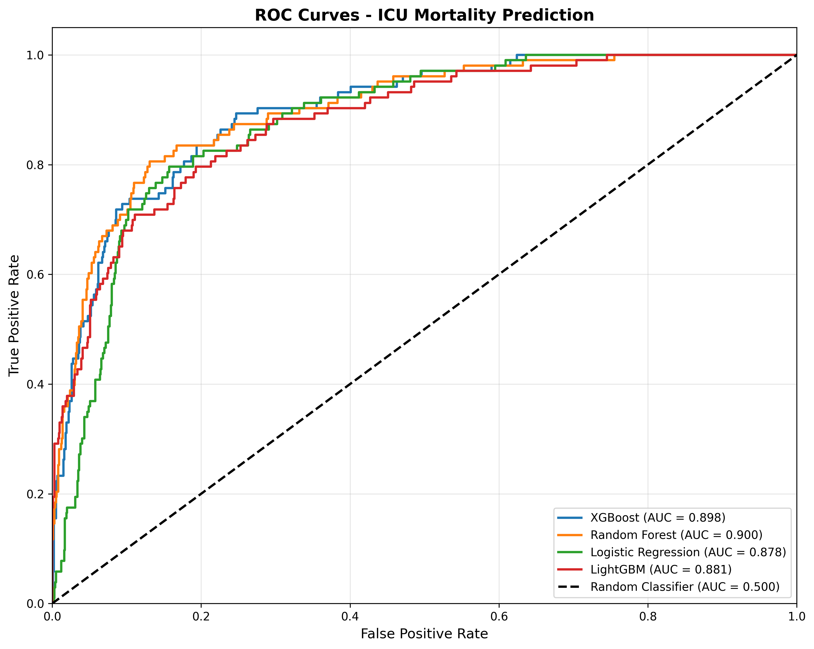

### 📈 Feature Importance

#### XGBoost
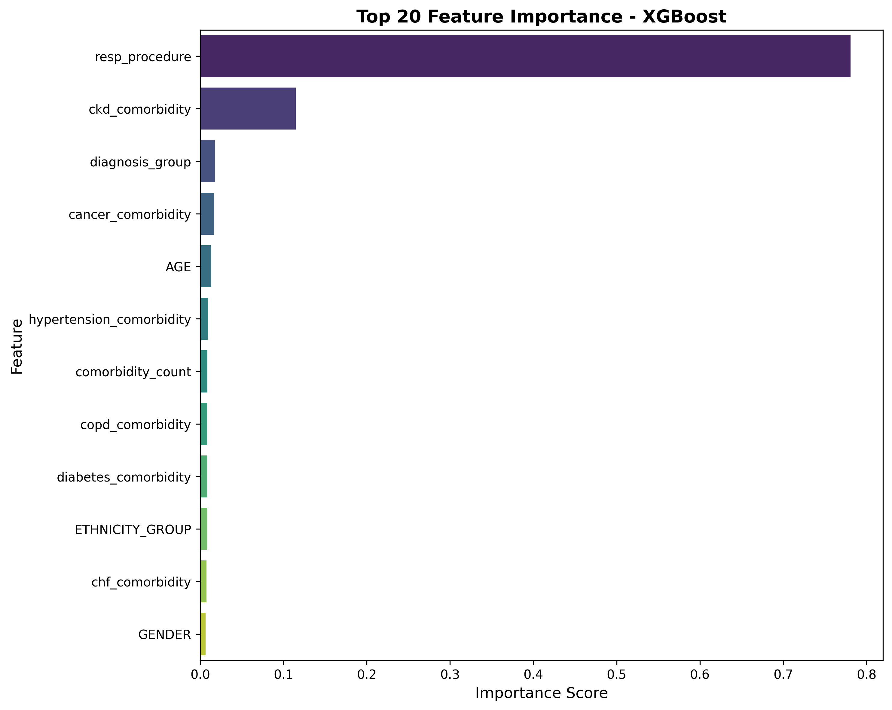
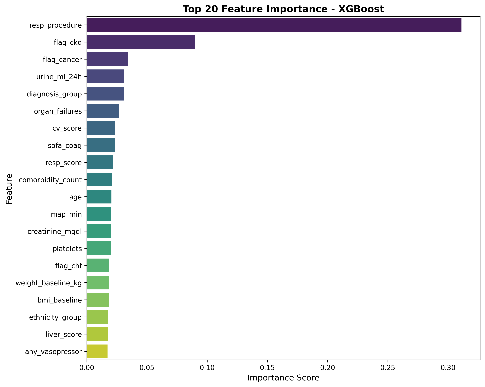

#### Random Forest
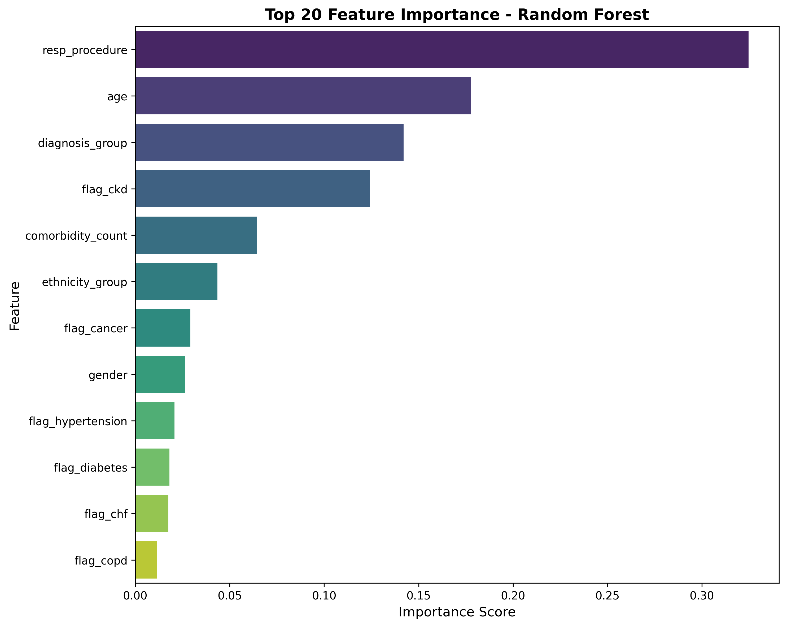


#### Logistic Regression
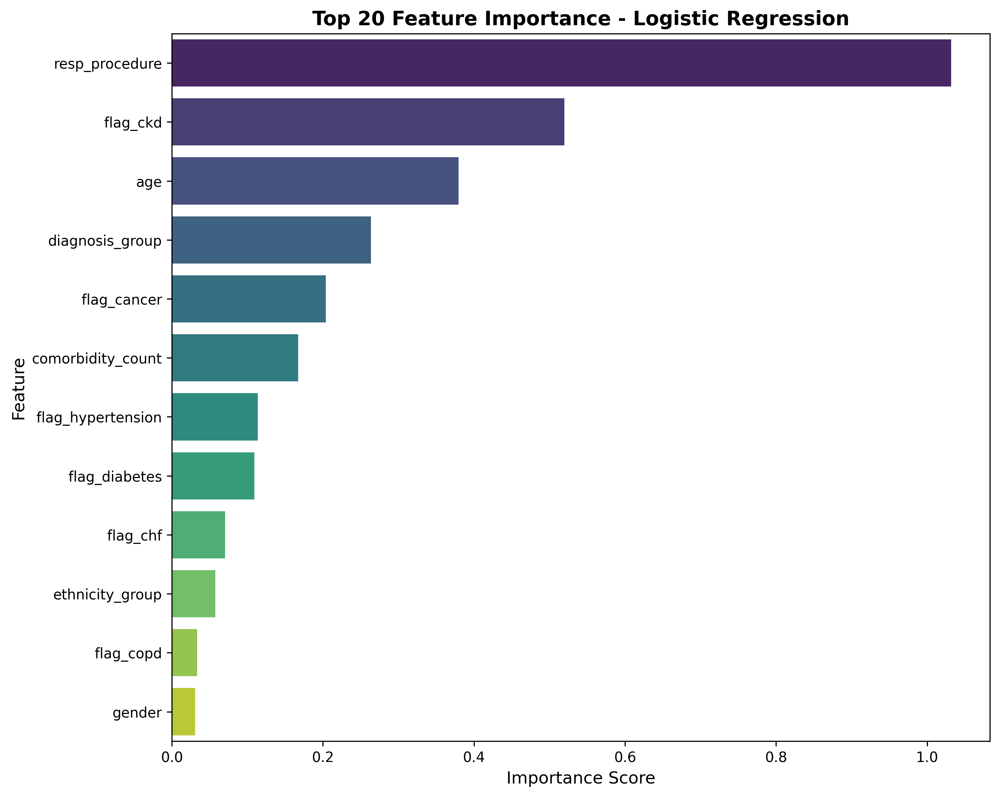
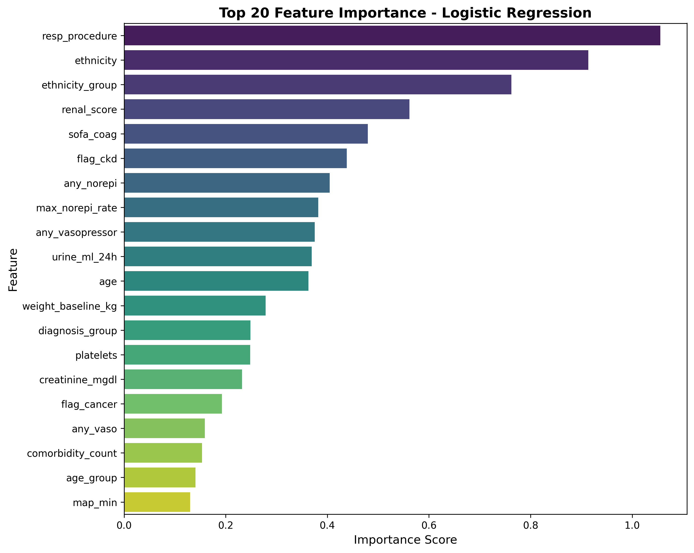

#### LightGBM
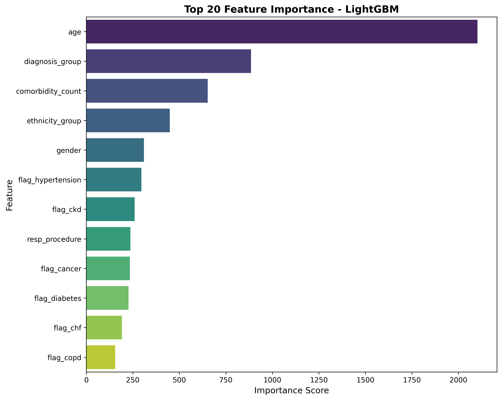
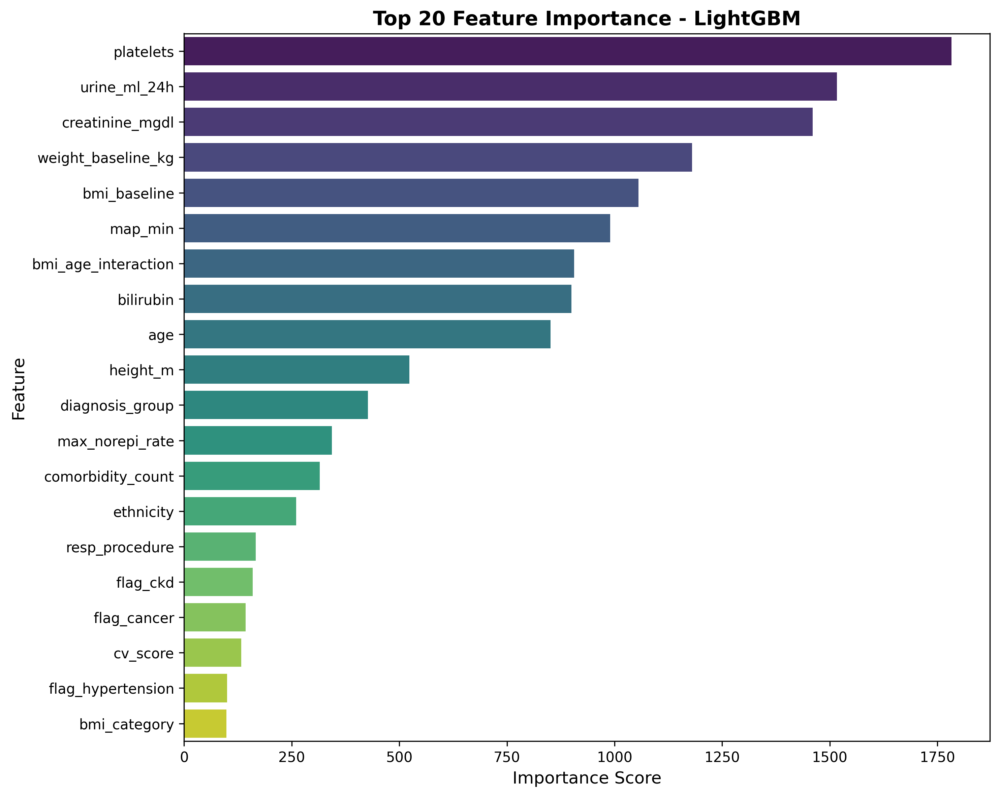

## 📊 Key Insights

### Top Predictors (Baseline Models):
1. **Respiratory procedure** (78-99% importance)
2. **CKD comorbidity** (11-49% importance)
3. **Age** (1-45% importance)

### Top Predictors (Enhanced with SOFA):
1. **SOFA Score** (dominant predictor when included)
2. **Respiratory procedure**
3. **CKD comorbidity**
4. **Age**


## 📚 Additional Documentation

### Internal Documentation
- [API Usage Guide](P3/api/API_USAGE_GUIDE.md) - Complete API reference with examples
- [Model Improvements Summary](P3/documentation/MODEL_IMPROVEMENTS_SUMMARY.md) - Enhancement details
- [Models Comparison Report](P3/documentation/MODELS_COMPARISON_REPORT.md) - Detailed analysis
- [Scientific Publication](P3/documentation/scientific_publication.md) - Research manuscript

### External Resources
- **Project Documentation:** [Google Docs](https://docs.google.com/document/d/1jtew0pYUJpSkwmLqGZSX7vngA6w2bO7PyxG_eQxJaOs/edit?usp=sharing)
- **Presentation Slides:** [Canva](https://www.canva.com/design/DAG_ROmPp2U/qoFy4FqXyg_ZQX-WbI1gAg/edit?utm_content=DAG_ROmPp2U&utm_campaign=designshare&utm_medium=link2&utm_source=sharebutton)

---

## 🏆 Summary

**Project Type:** ICU Mortality Risk Prediction  
**Best Model:** Random Forest with SOFA score  
**Performance:** 91.7% Accuracy | 0.904 AUC  
**Total Models:** 8 (4 baseline + 4 SOFA-enhanced)  
**API:** FastAPI with web interface  
**Deployment:** Production-ready with Cloudflare tunneling

